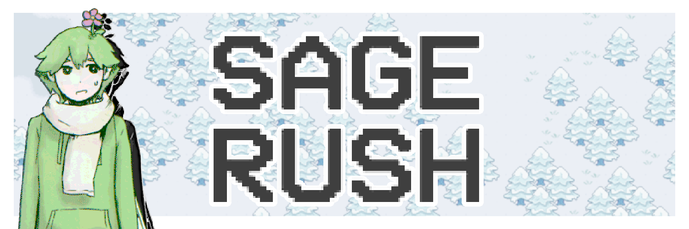
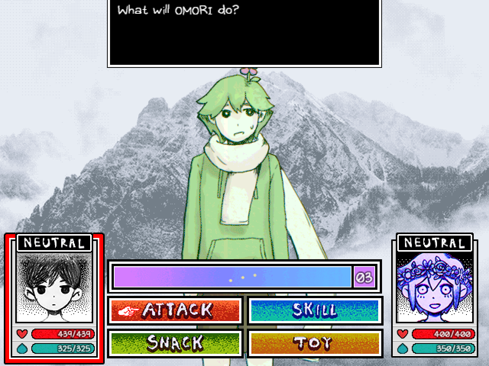
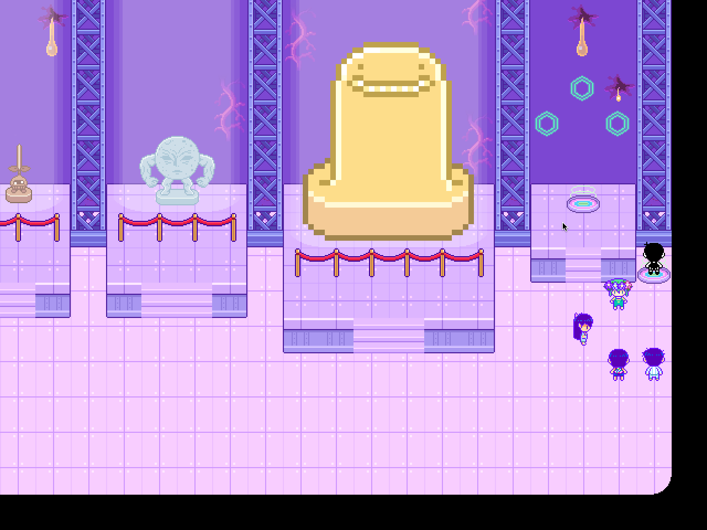
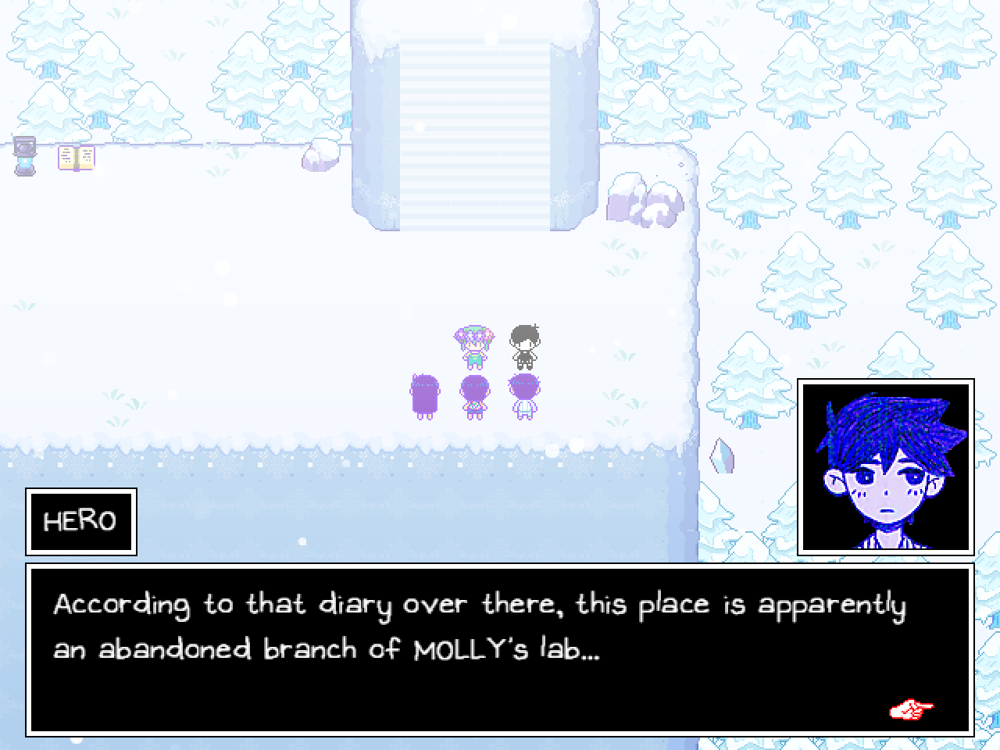

# Sage Rush!
Adds a Basil Rush-exclusive area inside the BOSS RUSH LOBBY!

**NOTE: This mod requires you to own the console edition of OMORI!**

This is for copyright reasons. OMOCAT made the choice to make Console Exclusive content exclusive to consoles, and I don't want to go against their wishes.
For more information, scroll down to **Setup.**

# Download
At the top of the page, click on sagerush.zip, then hit View Raw! It should immediately start downloading.

# Setup

  
Click to Open

First, you'll need console edition assets. I won't describe how to get this. Extract the sagerush folder inside the zip anywhere you'd like ("Extract Here", not "Extract to /*"), then open REQUIRED_FILES.txt. With your console edition assets, you need to extract each file to it's proper destination. If a folder doesn't exist, create it. Once you've done that, zip the sagerush folder back up, and drop the resulting zip in your OMORI mods folder.

After launching the game, head to the BOSS RUSH room (if you're already there, leave then re-enter.) and talk to Basil. Start the BASIL RUSH as normal, but don't enter the main teleporter. Instead, take the one on your right.

**Note: This mod is incompatible with any mod that adds Console Content, as it already includes such files. Thank you.**

# Screenshots!

  
Click to Open

# CREDITS

The-Red-Death on GameBanana for the original Console Port mod!

Akari L on Discord for the original Custom Battle Action Text I used!

OMOCAT for creating the game :)
